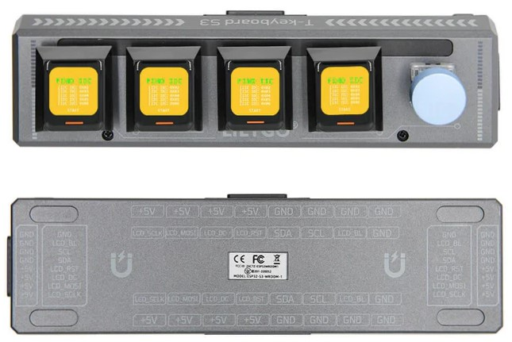

<!--
 * @Description: None
 * @Author: LILYGO_L
 * @Date: 2023-09-11 16:13:14
 * @LastEditTime: 2025-01-02 18:08:27
 * @License: GPL 3.0
-->
<h1 align = "center">T-Keyboard-S3-Pro</h1>

    

---

    

## **English | [中文](./README_CN.md)**

## Version iteration:

| Version    | Update date    | Update description  |
| :-----------: | :-----------: | :-----------: |
| T-Keyboard-S3-Pro_MCU_V1.1 | 2024-09-05              | Original version |
| T-Keyboard-S3-Pro_Keyboard_V1.1| 2024-09-05        | Original version |
| T-Keyboard-S3-Pro_Magnet_Female_V1.0| 2024-09-05        | Original version |
| T-Keyboard-S3-Pro_Magnet_Male_V1.0| 2024-09-05        | Original version |
| T-Keyboard-S3-Pro_Keyboard_LCD_FPC_V1.0| 2024-09-05        | Original version |

## PurchaseLink

| Product                     |Link               |
| :------------------------: | :-----------: |
| T-Keyboard-S3-Pro   |   [LILYGO Mall](https://lilygo.cc/products/t-keyboard-s3-pro?_pos=1&_sid=ab2fe5376&_ss=r)  |

## Directory
- [Describe](#Describe)
- [Preview](#Preview)
- [Module](#Module)
- [RelatedTests](#RelatedTests)
- [SoftwareGuidance](#SoftwareGuidance)
- [FAQ](#FAQ)
- [Project](#Project)

## Describe

This is an upgraded version of the T-Keyboard-S3 project named T-Keyboard-S3-Pro. The upgraded T-Keyboard-S3-Pro eliminates the external expansion interface from the original version, introducing four magnetic connection interfaces with quick connections. These magnetic interfaces allow for simultaneous interconnection of multiple T-Keyboard-S3-Pro devices (up to 6 devices, with the need to reduce the maximum brightness of the onboard LED to 10 when connecting multiple devices). An additional screen is added to the original four, resulting in a total of five screens. The fifth screen position on the main unit can be replaced with a rotary encoder. It is worth noting that due to the hardware's long-distance wiring, there are some restrictions on the board's expansion in the direction. Only one device can be expanded to the left and right of the main unit, and up to two devices can be expanded downwards (with a USB interface blocking expansion). This forms a grid layout of 2x3, totaling 6 devices.

The board also features 14 programmable RGB LED lights. When a single board is running, all of these lights can be set to their maximum brightness. However, when multiple boards are running, it is not advisable to set the brightness to maximum due to the large number of LEDs. If all the LEDs were to be brightly lit, they would generate significant heat, and the USB port's power supply has a limited current. Each additional board increases the impedance in the 5V voltage transmission. As a result, adjusting the LED brightness to 10 when connecting up to 6 devices is a reasonable setting, taking into account the various constraints such as heat generation, power supply limitations, and increased impedance.

## Preview

### Actual Product Image

    

---

    

---

    

### PCB board

#### 1. Size

    

---

    

#### 2. Module Description

    

---

    

## Module

### 1. Main MCU

* Model: ESP32­-S3-WROOM­-1
* Chip: ESP32-S3-R8
* PSRAM: 8M (Octal SPI)
* FLASH: 16M
* Dependent Libraries:
    >[ESP32-S3­-WROOM­-1_datasheet](https://www.espressif.com/sites/default/files/documentation/esp32-s3-wroom-1_wroom-1u_datasheet_en.pdf)
* Related Documentation:
    >[Arduino_DriveBus-1.1.2](https://github.com/Xk-w/Arduino_DriveBus)

### 2. Secondary MCU

* Chip: STM32G030F6P6
* SRAM: 8 Kbytes
* FLASH: 64 Kbytes
* Dependent Libraries:
    >[STM32G030F6_datasheet](https://www.st.com/en/microcontrollers-microprocessors/stm32g030f6.html#documentation)

### 3. Screen

* Screen Model: N085-1212TBWIG06-C08
* Size: 0.85-inch
* Resolution Ratio: 128x128px
* Screen Type: TFT
* Driver Chip: GC9107
* Bus Communication Protocol: Standard SPI
* Others: The RST, DC, MOSI, SCLK, and BL pins of all screens share a common bus. During initialization and reset, all screens are reset simultaneously. By selecting different CS lines, different screens can be controlled to refresh data.
* Related Documentation:
    >[GC9107_DataSheet_V1.2](./information/GC9107_DataSheet_V1.2.pdf)
* Dependent Libraries:
    >[TFT_eSPI-2.5.0](https://github.com/Bodmer/TFT_eSPI)  
    >[lvgl-8.3.5](https://github.com/lvgl/lvgl)   
    >[Arduino_GFX-1.3.7](https://github.com/moononournation/Arduino_GFX)  

### 4. Hot swappable button

* Specifications: The selected hot-swappable connector is from Kailh company, with a pin spacing of 6.35mm, making it compatible with all hot-swappable pins and buttons with a 6.35mm spacing.
* PCB connection: Pull enable to low voltage serves as a judgment signal. The KEY5 of the host is reused as the BOOT-0 for system power-on mode selection. By default, there is a 10K pull-up resistor, and low voltage is used as the judgment signal. In software, the pin must be configured as an internal pull-up to ensure stable usage.
* Others: Because screens need to be connected, please make sure to choose hot-swappable buttons with an opening in the middle, and the spacing should be greater than 7mm, which is wider than the ribbon cable width.

### 5. On board programmable LED lights

* Chip: WS2812C
* Related Documentation:
    >[WS2812C-2020](./information/WS2812C-2020.pdf)

### 6. Rotary encoder

* Describe: Four-legged copper top pin knob

## RelatedTests

## SoftwareGuidance

### 1. ESP32S3 host device software guidance

| Branch | `[PlatformIO (arduino-espressif32_v6.5.0)]` `[Arduino IDE (arduino-esp32-lib_v2.0.14)]`   Support |Description   |
| :-----------: | :-----------: | :-----------: | 
|[arduino-esp32-libs_v2.0.14](https://github.com/Xinyuan-LilyGO/T-Keyboard-S3-Pro/tree/arduino-esp32-libs_V2.0.14)| 
  
 | Example programs for ESP32S3 based on Arduino library version v2.0.14. |

### 2. STM32 Slave device software guidance

| Branch | `[STM32CubeMX (stm32cubeg0-firmware-package_v1.6.2)]` `[ARM Keil μVision5 (Keil.STM32G0xx_DFP.1.4.0.pack)]`   Support  |Description   |
| :-----------: | :-----------: | :-----------: | 
|[stm32cubeg0-firmware-package_v1.6.2](https://github.com/Xinyuan-LilyGO/T-Keyboard-S3-Pro/tree/stm32cubeg0-firmware-package_V1.6.2)|  
  
  | The STM32 sample program is written based on the STM32CubeG library version v1.6.2 and the chip library version v1.4.0. |

## FAQ

* Q. After reading the above tutorials, I still don't know how to build a programming environment. What should I do?
* A. If you still don't understand how to build an environment after reading the above tutorials, you can refer to the [LilyGo-Document](https://github.com/Xinyuan-LilyGO/LilyGo-Document) document instructions to build it.

* Q. Why can't I find any relevant example code?
* A. The relevant examples are placed in different branches for easier management. You can select and view examples for different chips based on the branches. Specific instructions are provided in the `Software Guide`.

 

## Project
* [SCH_T-Keyboard-S3-Pro_MCU_V1.1](./project/SCH_T-Keyboard-S3-Pro_MCU_V1.1.pdf)
* [SCH_T-Keyboard-S3-Pro_Keyboard_V1.1](./project/SCH_T-Keyboard-S3-Pro_Keyboard_V1.1.pdf)
* [SCH_T-Keyboard-S3-Pro_Magnet_Female_V1.0](./project/SCH_T-Keyboard-S3-Pro_Magnet_Female_V1.0.pdf)
* [SCH_T-Keyboard-S3-Pro_Magnet_Male_V1.0](./project/SCH_T-Keyboard-S3-Pro_Magnet_Male_V1.0.pdf)
* [SCH_T-Keyboard-S3-Pro_Keyboard_LCD_FPC_V1.0](./project/SCH_T-Keyboard-S3-Pro_Keyboard_LCD_FPC_V1.0.pdf)

